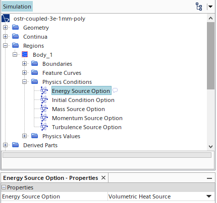
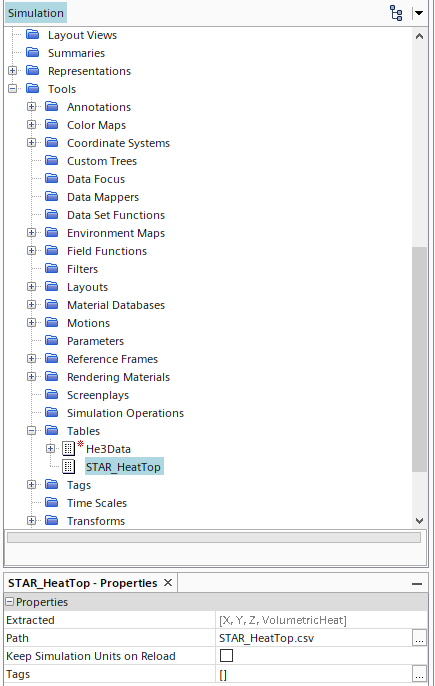
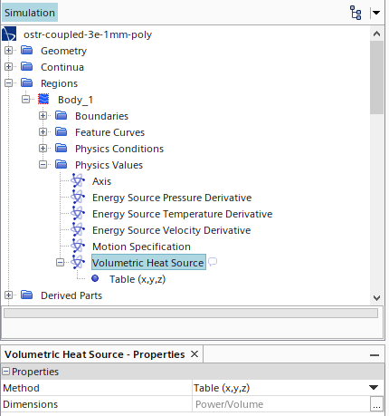
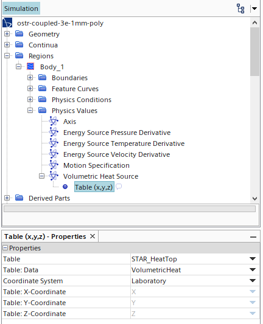

# STAR-CCM+ Model

This document details the STAR-CCM+ portion of **CONSTELATION**. Obtaining, verifying, and validating the model is up to the user. 

Development of OSTR HENRI STAR-CCM+ model can be found here: [OSTR STAR Model](https://github.com/warrenau/ostr-henri-starccm).


# Java Macro
The *`.java`* macro used to run the STAR-CCM+ simulation is created by STAR-CCM+, but needs to be modified. One of the modifications is to provide **CONSTELATION** with confirmation that the STAR-CCM+ simulation has read the *`SerpentDone.txt`* file so that the file is not deleted before the STAR-CCM+ simulation has time to read it. The following code checks if the done file exists, and if it does, a new file is created and written to for **CONSTELATION** to read.
```java
if (f.exists())
    {
    fileTable_2.extract();
    fw = new FileWriter("./ReadTop.txt",true);
    fw.write("Read");
    fw.close();
    }
```

To modify the *`.java`* macro for using different models, there are a couple of things that need to be changed. The first is the name of the `Region` that the macro will look at. I originally thought this was the Body `Part` because they have the same name and I found the `Part` first, but it threw an error when the `Region` was not named correctly.
```java
Region region_0 = 
    simulation_0.getRegionManager().getRegion("Body_1");
```
The part in quotes is the name listed in the STAR-CCM+ simulation. The image below shows the corresponding STAR-CCM+ dropdown for the example of code above.


Additionally, the number of time steps to be simulated between stops must be altered for each simulation. The time step value for the STAR-CCM+ simulation will most likely be smaller than the time step for the Serpent 2 simulation, possibly by multiple orders of magnitude. The input in the *`.java`* macro is the number of time steps STAR-CCM+ will simulate before waiting for the Serpent 2 time step to finish. For example, if the time step for the Serpent 2 simulation is 5E-6 s and the time step for the STAR-CCM+ simulation is 5E-8 s, the value input in the macro should be 100. Below is an example of the code where this value needs to be changed.

```java
    simulation_0.getSimulationIterator().setNumberOfSteps(100);
```
```java
    simulation_0.getSimulationIterator().step(100);
```

Both of these lines should have a matching number to each other that is the correct ratio of Serpent 2 time step to STAR-CCM+ time step.


For the `VolumetricHeatSourceProfile` to be imported correctly from the table generated by the **CONSTELATION** coupling script, the `Energy Source Option` in the `Physics Conditions` submenu under the selected `Region` must be set to `Volumetric Heat Source`, as seen in the figure below.




The *`.java`* macro will set up the STAR-CCM+ simulation to use the table written by **CONSTELATION** with the following code:
```java
    FileTable fileTable_2 = 
      (FileTable) simulation_0.getTableManager().createFromFile(resolvePath("STAR_HeatTop.csv"));

    Region region_0 = 
      simulation_0.getRegionManager().getRegion("Body_1");

    VolumetricHeatSourceProfile volumetricHeatSourceProfile_0 = 
      region_0.getValues().get(VolumetricHeatSourceProfile.class);

    volumetricHeatSourceProfile_0.setMethod(XyzTabularScalarProfileMethod.class);

    volumetricHeatSourceProfile_0.getMethod(XyzTabularScalarProfileMethod.class).setTable(fileTable_2);

    volumetricHeatSourceProfile_0.getMethod(XyzTabularScalarProfileMethod.class).setData("VolumetricHeat");
```
The final line of code was added to make sure the correct column of the table is selected to import the data from. It was implememented after encountering an error about not finding a `null` column in the table since that is the default for a new table set up for `Volumetric Heat Source`. STAR-CCM+ will save settings into the simulation file so when a new file table is created, it may use the desired column name if it was already set up, but this line of code will ensure the correct column is used. The following images show the GUI options selected to make the macro, and thus the options the macro selects when it runs. Each image is preceeded by the individual lines of code associated with the options selected.

```java
FileTable fileTable_2 = 
      (FileTable) simulation_0.getTableManager().createFromFile(resolvePath("STAR_HeatTop.csv"));
```




```java
    Region region_0 = 
      simulation_0.getRegionManager().getRegion("Body_1");

    VolumetricHeatSourceProfile volumetricHeatSourceProfile_0 = 
      region_0.getValues().get(VolumetricHeatSourceProfile.class);

    volumetricHeatSourceProfile_0.setMethod(XyzTabularScalarProfileMethod.class);
```




```java
    volumetricHeatSourceProfile_0.getMethod(XyzTabularScalarProfileMethod.class).setTable(fileTable_2);

    volumetricHeatSourceProfile_0.getMethod(XyzTabularScalarProfileMethod.class).setData("VolumetricHeat");
```

